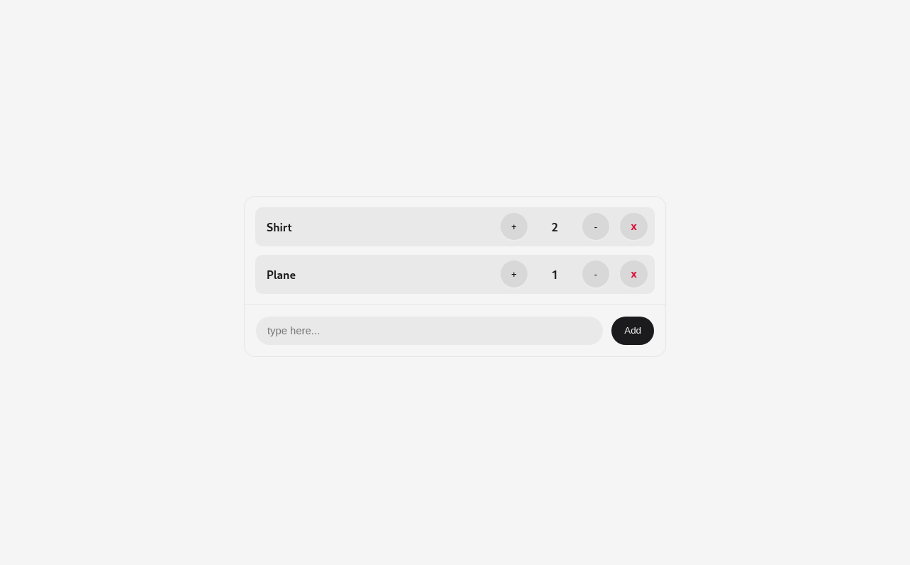

# About this Project
- Shopping cart example .

# Getting Started
- Download the repository .
- `cd *folder_name*`
- use `npm start` to start a localhost

or
- you can try it from this [link](https://juste3sar.github.io/shopping-cart/)

# Screenshot

